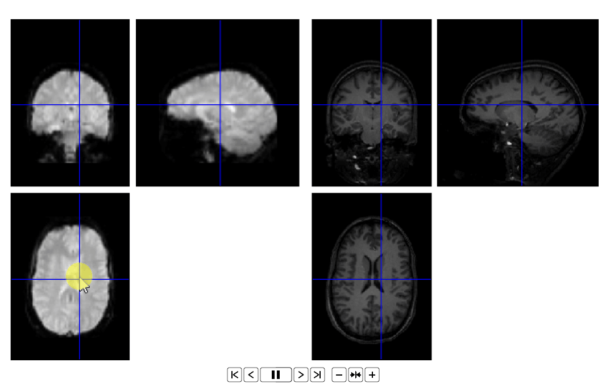
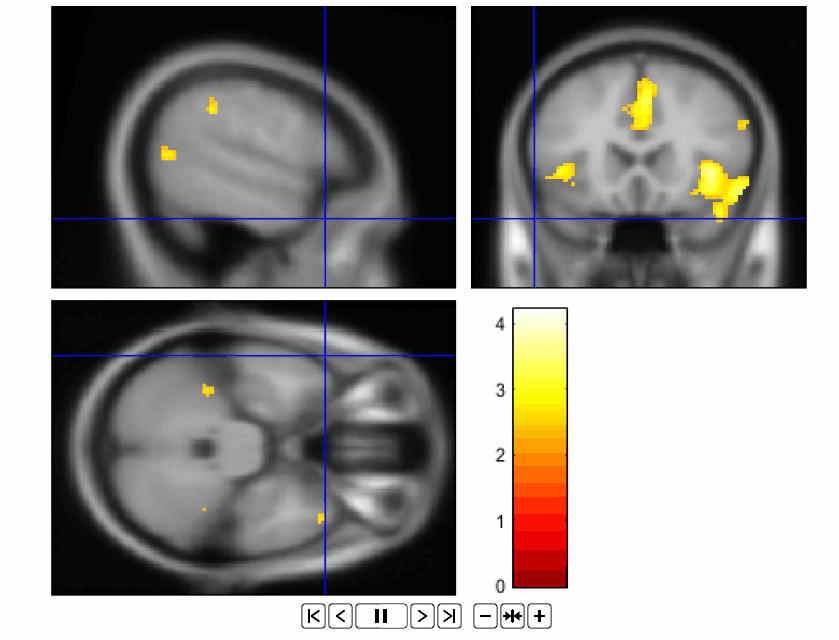
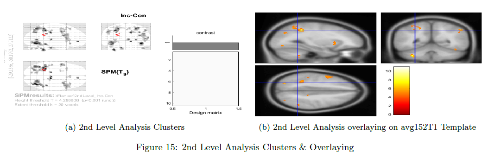

 # fMRI Preprocessing, Statistical Analysis, ROI Analysis
 All Details with Gifs are available on the pdf, Please use an appropriate pdf viewer like Adobe Acrobate or Foxit Reader.
 Scripting for automating the preprocessing  and 1st level analysis is available in .m file extension 

- Preprocessing
  - Realigning and Unwarping the Data.
  - Slice Timing Correction.
  - Coregisteration.
  - Segmentation.
  - Normalization.
- Statistics and Modeling 
  - The Time-Series.
  - BOLD Signal as an Indirect Measure of Neural Firing. 
  - The Hemodynamic Response Function (HRF). 
  - The General Linear Model. 
  - Creating Timing Files.

- First Level Analysis 
  - Estimating The Model & The Contrast Manager.
  - Examining The Output. 
- Scripting and Setting the Origin
- 2nd Level Analysis. 
- Region of Interest Analysis - ROI 
    - ROI Analysis Using Atlases from (WFU PickAtlas toolbox). 
    - Extracting Data from the Anatomical Mask. 
    - ROI Analysis Using spherical ROI approach.

    

    

    

    